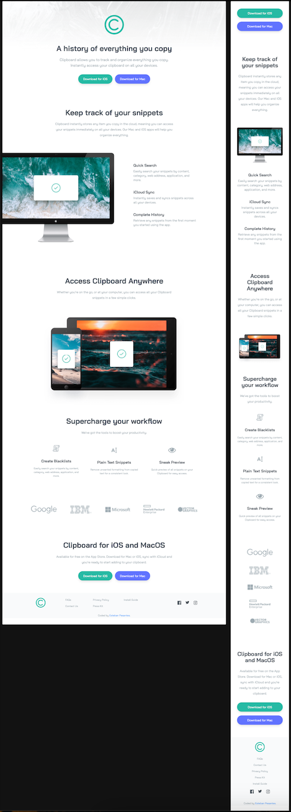

## Table of contents

- [Overview](#overview)
  - [The challenge](#the-challenge)
  - [Screenshot](#screenshot)
  - [Links](#links)
- [My process](#my-process)
  - [Built with](#built-with)
  - [Continued development](#continued-development)
  - [Useful resources](#useful-resources)
- [Author](#author)
- [Acknowledgments](#acknowledgments)

## Overview

### The challenge

Users should be able to:

- View the optimal layout for the site depending on their device's screen size
- See hover states for all interactive elements on the page

### Screenshot

### Links

- [live site URL here](https://spiffy-truffle-d08c6c.netlify.app/)

## My process

### Built with

- Semantic HTML5 markup
- Tailwind CSS
- Mobile-first workflow
- [Tailwind](https://tailwindcss.com/) - Utility first CSS Framework

### Continued development

This is my very first project using Tailwind. I'm still developing my skillset and I recently started learning this CSS framework. I'm enjoying it so far but still have ways to go before I feel confident using it. I find the customization directly on the markup easy, its the additional modules and config files (functions/directives) that I need additional exposure to/practice.

### Useful resources

- [Tailwind website](https://www.tailwindcss.com) - This helped me for the overall documentation as well as learning how to tackle this project using Tailwind CLI vs the Play CDN.
- [Tailwind cheatsheet](https://nerdcave.com/tailwind-cheat-sheet) - This is an amazing one stop shop I referred back to often. Already have it bookmarked.

## Author

- Frontend Mentor - [@estebanp2022](https://www.frontendmentor.io/profile/estebanp2022)

## Acknowledgments

I'm currently taking a Udemy course on Tailwind CSS. I completed this project with the guidance of the course author Brad Traversy. Highly recommend.
